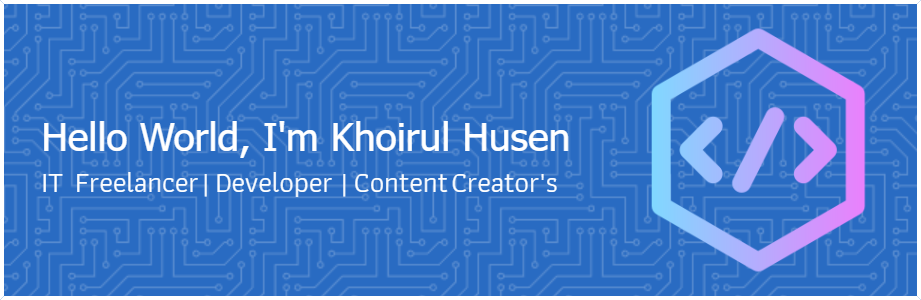

## Hello World, I'm Khoirul Husen 👋

I'm a Freelancer Web Developer, I like learn about Technology and I like to create Online Learning Content about the World of Technology.

##### My Skills

##### Connect With Me
 

##### My GitHub Stats

###

<!--
**hoirulhusen08/hoirulhusen08** is a ✨ _special_ ✨ repository because its `README.md` (this file) appears on your GitHub profile.

Here are some ideas to get you started:

- 🔭 I’m currently working on ...
- 🌱 I’m currently learning ...
- 👯 I’m looking to collaborate on ...
- 🤔 I’m looking for help with ...
- 💬 Ask me about ...
- 📫 How to reach me: ...
- 😄 Pronouns: ...
- ⚡ Fun fact: ...
-->
